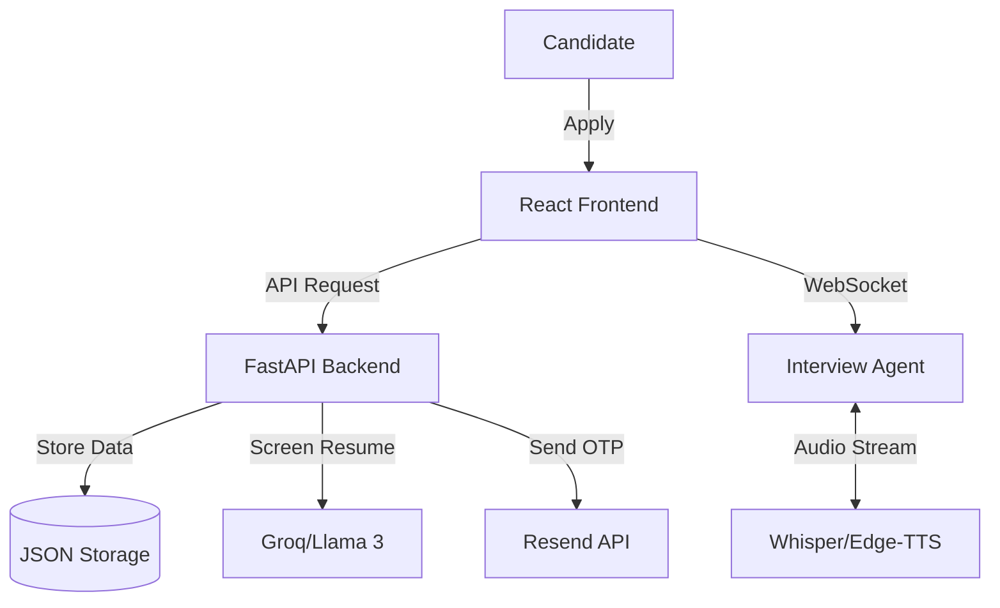

# Enterprise AI Hiring Manager


A full-stack, automated recruitment system featuring **AI Resume Screening**, **OTP-secured rounds**, **Interactive Skill Assessments**, and a **Real-time Speech-to-Speech HR Interviewer**.

---

## System Architecture



## Key Features

| Feature | Description |
| :--- | :--- |
| **AI Resume Screening** | Automatically evaluates resumes against job roles using LLMs with a binary suitability classifier. |
| **OTP-Secured Journey** | Every recruitment stage (Aptitude, DSA, HR Interview) is protected by a unique OTP. |
| **Interactive Quizzes** | 5-question logic/math & technical assessments with automatic scoring. |
| **AI HR Interview** | Real-time speech-to-speech interaction powered by Llama 3.3, Whisper, and Edge-TTS. |
| **Candidate Analytics** | Automatic evaluation of technical and behavioral proficiency with visual score reports. |

## Tech Stack

### Backend
-   **Framework**: FastAPI
-   **AI Orchestration**: Agno
-   **LLM Inference**: Groq / OpenRouter (Llama 3.3 70B)
-   **Vector DB**: Qdrant
-   **Audio**: Web Audio API, Whisper, Edge-TTS

### Frontend
-   **Framework**: React (Vite)
-   **Styling**: Vanilla CSS (Glassmorphism)
-   **State Management**: React Hooks

## Project Structure

```bash
AI_Hiring_Manager/
├── api/                   # FastAPI routes & config
├── core/                  # Business logic (AI, Auth, Notifications)
├── gcc-hiring-frontend/   # React Client
└── data/                  # Local persistence
```

## Getting Started

### Prerequisites
-   Python 3.10+
-   Node.js & npm

### Installation

1.  **Clone the repository**
    ```bash
    git clone <repo-url>
    cd AI_Hiring_Manager
    ```

2.  **Backend Setup**
    ```bash
    uv venv
    source .venv/bin/activate
    uv pip install -r requirements.txt
    cp .env.example .env  # Configure API keys
    ```

3.  **Frontend Setup**
    ```bash
    cd gcc-hiring-frontend
    npm install
    ```

### Running the Application

1.  **Start Backend**
    ```bash
    # From project root
    uv run python api/main.py
    ```

2.  **Start Frontend**
    ```bash
    # From gcc-hiring-frontend directory
    npm run dev
    ```

## Recruitment Workflow

1.  **Apply**: Candidate submits resume. AI screens for role suitability.
2.  **Verify**: Shortlisted candidates receive an Aptitude OTP (check server logs/email).
3.  **Aptitude Round**: complete logic quiz (Score > 3/5 to pass).
4.  **DSA Round**: Complete technical quiz.
5.  **HR Interview**: Real-time voice conversation with AI.
6.  **Results**: Receive proficiency summary.

## License

MIT License. See [LICENSE](LICENSE) for details.
